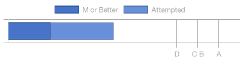
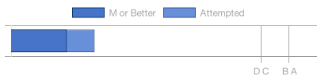

# Progress Report for Leila Anderson
    Note:  This is a draft of the progress report generator.  This version only shows the
    marks I have for each graded item.  Future reports will contain more detail.
## Learning Objectives
|Learning Objectives|Grade|Late Days|
|------|-------|-------|
|Origins (o1)|x **p**|0|
|Get/Post (m1)|x **m**|0|
|Implementation (i1)|x **p**|0|
|URL parts (i2)|**p**|0|
|Write CSS (h3)|**m**|0|

|E|M|P|X|
|------|-------|-------|-------|
|0|2|3|0|

2 at 'm' or better.

## Homework
|Homework|Grade|Late Days|
|------|-------|-------|
|Web Client (H1)|. **m**|0|
|Web Server (H2)|**m**|0|
|Qwixx Board (H3)|**p**|0|

|E|M|P|X|
|------|-------|-------|-------|
|0|2|1|0|

2 at 'm' or better.

## Projects
|Projects|Grade|Late Days|
|------|-------|-------|
|C Project (c)|A|0|

## Legend 
* `e`: Exceeds expectations
* `m`: Meets expectations
* `p`: Progressing
* `n`: Not Yet
* `x`: Missing
* `.`: Waiting for submission
* `d`: Demonstrated but not yet graded
* `r`: Received but not yet graded
* `?`: Received; Grading in progress
* `!`: Error in grade sheet
